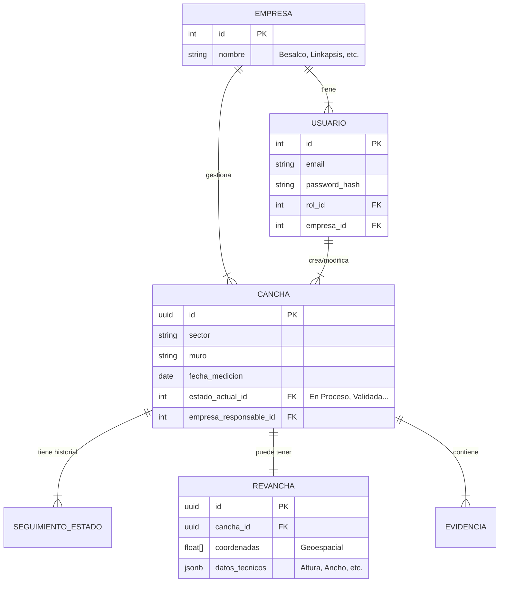
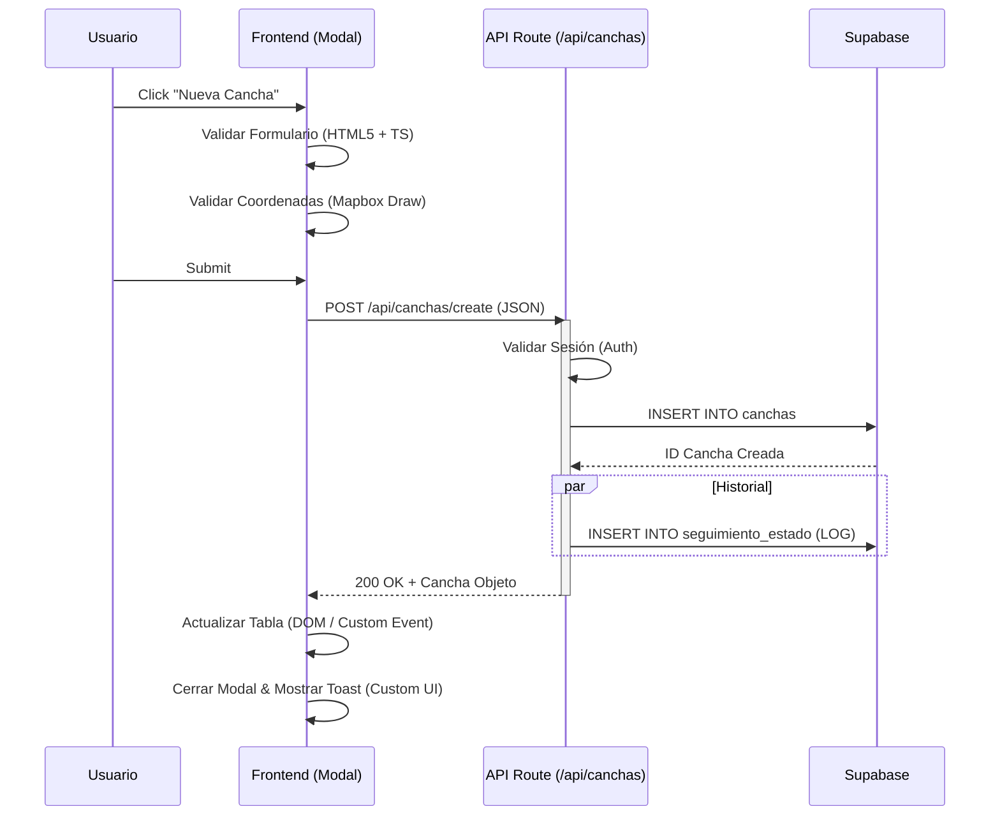
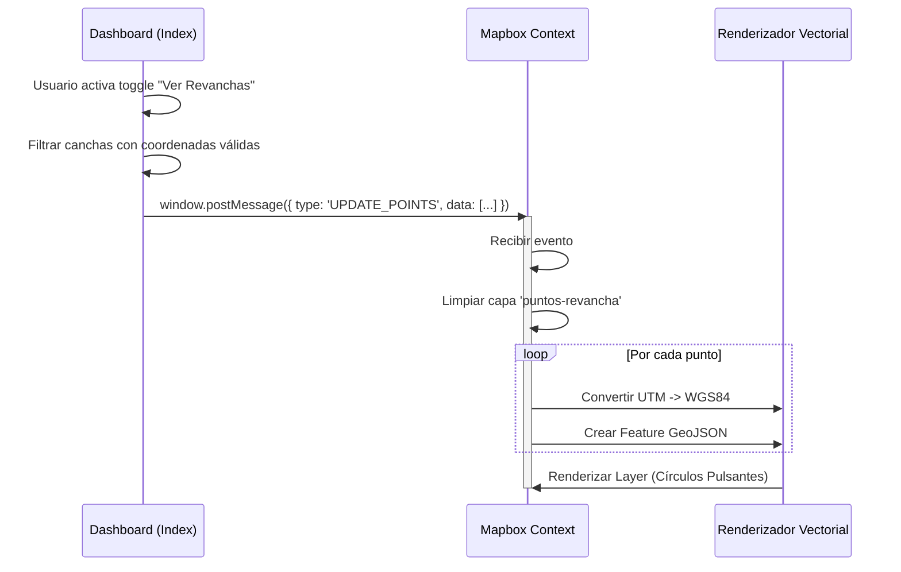

# Arquitectura de Software Final: Sistema de Gestión de Canchas AngloAmerican

**Versión del Documento:** 1.0
**Fecha:** 2026-01-15
**Estado:** Final Release

## 1. Resumen Ejecutivo
Este documento describe la arquitectura técnica del sistema de gestión de canchas y revanchas para AngloAmerican. El sistema es una aplicación web moderna, renderizada en servidor (SSR) y optimizada para la gestión masiva de datos geoespaciales y administrativos críticos para la operación minera. La arquitectura privilegia la **robustez**, la **seguridad basada en roles** y la **visualización de datos complejos** (mapas de alta precisión).

---

## 2. Stack Tecnológico

La elección de tecnologías responde a la necesidad de **rendimiento (SSR)** y **modulariad**.

### 2.1 Backend & Renderizado
*   **Framework Principal:** [Astro 5.0](https://astro.build/) (Modo SSR - Server Side Rendering).
    *   *Justificación:* Permite generar HTML dinámico en el servidor para una carga inicial rápida y SEO, hidratando solo las islas de interactividad necesarias (Islands Architecture).
*   **Lenguaje:** TypeScript / JavaScript (ESModules).
*   **Runtime:** Node.js v18+.

### 2.2 Frontend & UI
*   **Interfaz:** HTML5 Semántico + Custom Web Components.
*   **Estilos:** CSS3 Nativo (Variables CSS, Flexbox/Grid) para máximo control y menor overhead.
*   **Visualización de Datos:** Chart.js (Gráficos estadísticos).
*   **GIS / Mapas:** Mapbox GL JS v3 + Mapbox Draw + TileServer GL (Local) para ortomosaicos de alta resolución.

### 2.3 Persistencia y Datos
*   **Base de Datos Relacional:** PostgreSQL (vía [Supabase](https://supabase.com/)).
*   **Almacenamiento de Archivos:** Supabase Storage (para evidencias PDF/Imágenes).
*   **ORM / Query Builder:** Cliente nativo de Supabase (`@supabase/supabase-js`).

---

## 3. Arquitectura del Sistema (C4 Model - Nivel Contenedor)

El sistema sigue una arquitectura monolítica modular con separación clara entre lógica de presentación, lógica de negocio y capa de datos.

```mermaid
graph TD
    User((Usuario Minero))
    
    subgraph "Cliente (Navegador)"
        UI[Interfaz Web Astro]
        AuthStore[Auth Singleton Store]
        MapComp[Componente Mapa WebGL]
    end

    subgraph "Servidor de Aplicación (Node.js/Astro)"
        Router[Astro Router SSR]
        APIGuard[API Routes & Guards]
        Controller[Controladores de Negocio]
    end

    subgraph "Capa de Datos"
        DB[(PostgreSQL / Supabase)]
        Storage[(Object Storage)]
        TileServer[TileServer GL (Mapas)]
    end

    User -->|HTTPS| Router
    UI -->|Fetch/XHR| APIGuard
    Router -->|Query| DB
    APIGuard -->|Query| DB
    MapComp -->|Tiles| TileServer
    Controller -->|Read/Write| DB
```

---

## 4. Diseño Modular

La aplicación se estructura en módulos funcionales independientes pero interconectados.

### 4.1 Módulo de Autenticación (`Auth Module`)
Gestiona la identidad y el control de acceso.
*   **Componentes:** `src/pages/login.astro`, `src/utils/authStore.ts`, `src/components/AuthGuard.astro`.
*   **Patrón:** **Singleton** (`authStore`) para mantener el estado de la sesión en el cliente y **HOC** (`AuthGuard`) para proteger rutas.
*   **Seguridad:** Tokens persistentes en `localStorage` con expiración automática (8 horas) y validación de roles (`Admin`, `Usuario`, `Visita`).

### 4.2 Módulo Dashboard Core (`Dashboard Module`)
El núcleo de la operación diaria. Centraliza la visualización y gestión.
*   **Controlador Principal:** `src/pages/index.astro`. Actúa como orquestador masivo.
*   **Responsabilidades:**
    *   **Filtrado:** Lógica compleja de filtros cruzados (Fecha + Estado + Empresa + "Mis Acciones").
    *   **Estadísticas:** Cálculo en tiempo real de KPIs (`actualizarContadorResultados`).
    *   **Tabla:** Renderizado dinámico de miles de registros con paginación virtual.

### 4.3 Módulo GIS (`Geographic Information System`)
Maneja la complejidad de los datos espaciales.
*   **Componentes:** `src/components/MiningMap.astro`, `src/pages/mapbox-window.astro`.
*   **Drivers:** `src/utils/gis.ts` (Manejo de GeoJSON), `src/utils/mapbox.ts` (Proyecciones).
*   **Lógica Crítica:** Conversión de coordenadas en tiempo real entre **UTM Zone 19S** (Topografía minera) y **WGS84** (Estándar Web).

---

## 5. Diseño de Base de Datos (Esquema Relacional)

El modelo de datos está diseñado para integridad referencial y auditoría a través de múltiples empresas contratistas.



---

## 6. Diagramas de Flujo Clave

### 6.1 Flujo de Creación de Cancha
Desde la acción del usuario hasta la persistencia y notificación.



### 6.2 Flujo de Visualización Mapa (Revanchas)
Cómo se conectan los datos tabulares con la visualización geoespacial.



---

## 7. Atributos de Calidad y Decisiones Técnicas

### 7.1 Rendimiento
*   **SSR (Server Side Rendering):** La carga inicial (`FCP`) es extremadante rápida porque el servidor envía HTML pre-renderizado, evitando el "spinner hell" de las SPAs tradicionales.
*   **Paginación Lógica:** La tabla de canchas maneja paginación en memoria para una respuesta instantánea al filtrar, soportando miles de filas sin lag.

### 7.2 Mantenibilidad
*   **Código Tipado:** Uso estricto de TypeScript en utilidades y APIs para prevenir errores de tipo en tiempo de compilación.
*   **Arquitectura de Componentes:** UI reutilizable (Modales, Botones, Badges) evitando duplicación de código HTML/CSS.

### 7.3 Extensibilidad
*   El sistema está diseñado para soportar **N** empresas nuevas simplemente añadiendo un registro en la tabla `empresas` y subiendo su logo a `src/img_companies/`. La lógica de negocio (`filtrarPorAccionesDisponibles`) escala automáticamente.

### 7.4 Seguridad
*   **Row Level Security (RLS):** Aunque la aplicación filtra en el frontend, la base de datos Supabase está preparada con políticas RLS para que técnicamente un usuario de "Besalco" jamás pueda consultar filas de "Linkapsis" a nivel de query.

---

## 8. Conclusión

La arquitectura implementada provee una solución **sólida, escalable y segura** para la gestión minera. La integración profunda mediante **Astro** y **Mapbox**, sumada a una base de datos relacional robusta, garantiza que el sistema no solo cumple con los requisitos actuales de visualización y control, sino que está preparado para evolucionar hacia gemelos digitales o integraciones IoT futuras.
