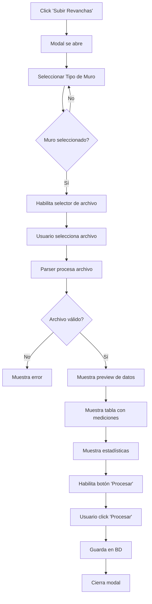
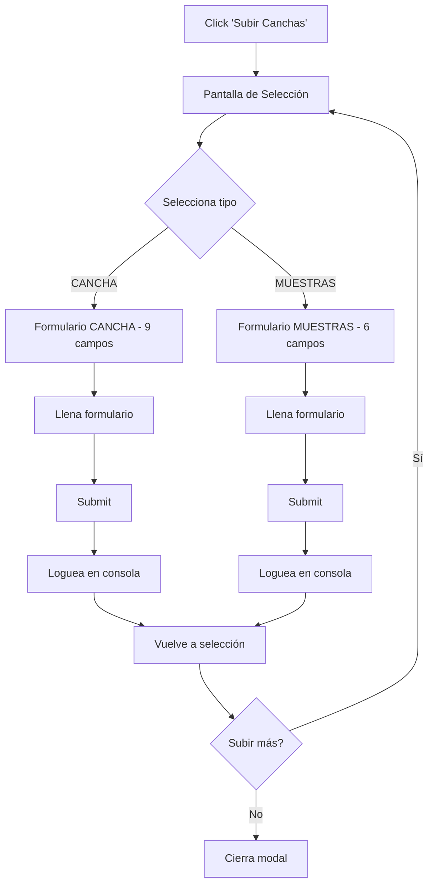

# 📚 Documentación: Funcionalidades Linkapsis

## 🎯 Propósito

Este documento consolida la documentación de las dos funcionalidades especiales del botón "Subir" para usuarios de Linkapsis en el dashboard principal.

**Fecha**: 22 de diciembre de 2025  
**Usuario**: Linkapsis  
**Ubicación**: `src/pages/index.astro`

---

## 📋 Índice

1. [Subir Revanchas](#1-subir-revanchas)
2. [Subir Canchas/Muestras](#2-subir-canchasmuestras)
3. [Comparativa](#3-comparativa)

---

## 1. 📤 Subir Revanchas

### Descripción
Modal para cargar archivos Excel (XLSX/XLS) o CSV con datos de mediciones de revanchas para los tres muros del tranque.

### Ubicación en Código
- **Modal HTML**: Líneas 4303-4405
- **JavaScript Parser**: Líneas 8854-9780
- **Botón**: Línea 3732

### Flujo de Usuario



### Campos del Formulario

| Campo | Tipo | Requerido | Descripción |
|-------|------|-----------|-------------|
| **Tipo de Muro** | Select | ✅ | Principal, Oeste, Este |
| **Archivo** | File | ✅ | CSV, XLSX, XLS |

### Configuraciones por Muro

#### Muro Principal
```javascript
{
  headerRow: 12,
  dataStartRow: 13,
  dataEndRow: 85,
  dateCell: "F6",
  sectores: 7 (S1-S7),
  columnas: {
    sector: "A",
    coronamiento: "C",
    revancha: "E",
    lama: "F",
    ancho: "H",
    pk: "I",
    geomembrana: "J",
    distGeoLama: "K",
    distGeoCoronamiento: "L"
  }
}
```

#### Muro Oeste
```javascript
{
  headerRow: 9,
  dataStartRow: 10,
  dataEndRow: 45,
  dateCell: "F6",
  sectores: 3 (S1-S3),
  columnas: similares a Principal
}
```

#### Muro Este
```javascript
{
  headerRow: 9,
  dataStartRow: 10,
  dataEndRow: 38,
  dateCell: "F6",
  sectores: 3 (S1-S3),
  columnas: similares a Principal
}
```

### Datos Extraídos

```javascript
{
  tipoMuro: "principal" | "oeste" | "este",
  fechaMedicion: "2024-12-22",
  totalRegistros: 73,
  sectores: ["S1", "S2", "S3", ...],
  mediciones: [
    {
      sector: "S1",
      pk: "0+000",
      coronamiento: 1234.56,
      revancha: 3.45,
      lama: 1231.11,
      ancho: 25.30,
      geomembrana: 1230.00,
      distGeoLama: 1.11,
      distGeoCoronamiento: 4.56
    },
    // ... más mediciones
  ]
}
```

### Funcionalidades del Parser

#### 1. Detección Automática de Fecha
- Lee celda combinada F6 (filas 6-7)
- Formatos soportados: "DD/MM/YYYY", "DD-MM-YYYY", "YYYY-MM-DD"
- Extrae fecha de texto como "Fecha: 15/12/2024"

#### 2. Validación de Datos
- ✅ Verifica estructura del archivo
- ✅ Valida rangos de filas
- ✅ Detecta sectores automáticamente
- ✅ Valida tipos de datos numéricos
- ✅ Maneja celdas vacías

#### 3. Preview de Datos
- Tabla HTML con todas las mediciones
- Resumen estadístico:
  - Total de registros
  - Fecha de medición
  - Sectores incluidos
  - Rango de PKs
- Estadísticas por sector:
  - Cantidad de mediciones
  - Rango de PKs
  - Promedios de revancha y ancho

#### 4. Visualización de Perfil
- Gráfico Chart.js con perfil de revancha
- Eje X: PKs
- Eje Y: Valores de revancha
- Colores por sector
- Líneas de alerta (3.0m, 4.0m)

### Estado Actual
- ✅ **Parser completo** - Lee archivos Excel/CSV
- ✅ **Validación** - Verifica estructura y datos
- ✅ **Preview** - Muestra tabla y estadísticas
- ✅ **Gráfico** - Perfil de revancha con Chart.js
- ⚠️ **Sin backend** - No guarda en BD (botón "Procesar" deshabilitado)

### Librerías Utilizadas
- **SheetJS (XLSX)** - Parser de archivos Excel
- **Chart.js** - Gráficos de perfil

---

## 2. 📁 Subir Canchas/Muestras

### Descripción
Modal con flujo de dos pasos para cargar información de canchas o muestras, con selección previa del tipo de datos.

### Ubicación en Código
- **Modal HTML**: Líneas 4407-4680
- **JavaScript**: Líneas 9792-10082
- **CSS**: Líneas 3466-3665
- **Botón**: Línea 3603

### Flujo de Usuario



### PASO 1: Pantalla de Selección

Dos tarjetas minimalistas:

| Opción | Icono | Campos |
|--------|-------|--------|
| **CANCHA** | 🏗️ | 9 campos |
| **MUESTRAS** | 🧪 | 6 campos |

### PASO 2A: Formulario CANCHA

| # | Campo | Tipo | Requerido | Descripción |
|---|-------|------|-----------|-------------|
| 1 | **Muro** | Select | ✅ | Principal, Este, Oeste |
| 2 | **Sector** | Select | ✅ | S1-S7 (Principal) o S1-S3 (Este/Oeste) |
| 3 | **Relleno** | Text | ✅ | Nombre del relleno |
| 4 | **Fecha** | Date | ✅ | Fecha de la cancha |
| 5 | **Foto** | File | ❌ | JPG, PNG (máx 5MB) |
| 6 | **Archivo** | File | ✅ | CSV, XLSX, ASC |
| 7 | **Responsable** | Select | ✅ | Usuarios de Linkapsis |
| 8 | **Método** | Select | ✅ | Movimiento de Tierra / Hidráulico |
| 9 | **N° Capas** | Select | ✅ | 1, 2, 3, 4 |

### PASO 2B: Formulario MUESTRAS

| # | Campo | Tipo | Requerido | Descripción |
|---|-------|------|-----------|-------------|
| 1 | **Muro** | Select | ✅ | Principal, Este, Oeste |
| 2 | **Sector** | Select | ✅ | S1-S7 (Principal) o S1-S3 (Este/Oeste) |
| 3 | **Relleno** | Text | ✅ | Nombre del relleno |
| 4 | **Fecha** | Date | ✅ | Fecha de la muestra |
| 5 | **Foto** | File | ❌ | JPG, PNG (máx 5MB) |
| 6 | **Archivo** | File | ✅ | CSV, XLSX, ASC |

### Datos Capturados

#### CANCHA
```javascript
{
  tipo: "CANCHA",
  muro: "Principal",
  sector: "S5",
  relleno: "Relleno Norte",
  fecha: "2025-12-22",
  foto: File {...} || null,
  archivo: File {...},
  responsable: 3, // ID usuario
  metodo: "Movimiento de Tierra",
  capas: "2"
}
```

#### MUESTRAS
```javascript
{
  tipo: "MUESTRA",
  muro: "Este",
  sector: "S2",
  relleno: "Muestra A",
  fecha: "2025-12-22",
  foto: File {...} || null,
  archivo: File {...}
}
```

### Funcionalidades Implementadas

#### 1. Navegación entre Pantallas
- Tarjetas clickeables para selección
- Botón "Volver" en cada formulario
- Transiciones suaves

#### 2. Selector Dinámico Muro → Sector
- Función genérica reutilizable
- Principal: S1-S7
- Este/Oeste: S1-S3

#### 3. Preview de Fotos
- Validación de tamaño (5MB máx)
- Preview con FileReader
- Funciona en ambos formularios

#### 4. Carga Dinámica de Responsables
- Filtra usuarios de Linkapsis (empresa_id=3)
- Solo usuarios activos
- Carga desde `/api/usuarios`

#### 5. Reset Inteligente
- Resetea formulario
- Oculta previews
- Resetea selectores
- Vuelve a pantalla de selección

### Estado Actual
- ✅ **UX completa** - Flujo de 2 pasos funcionando
- ✅ **Validación frontend** - HTML5 validation
- ✅ **Preview de fotos** - Ambos formularios
- ✅ **Selector dinámico** - Muro → Sector
- ⚠️ **Sin backend** - Solo loguea en consola

---

## 3. ⚖️ Comparativa

| Característica | Subir Revanchas | Subir Canchas/Muestras |
|----------------|-----------------|------------------------|
| **Propósito** | Mediciones de revanchas | Información de canchas/muestras |
| **Pasos** | 1 paso | 2 pasos (selección + formulario) |
| **Archivos** | Excel/CSV específico | CSV/XLSX/ASC genérico |
| **Parser** | ✅ Completo con validación | ❌ No implementado |
| **Preview** | ✅ Tabla + gráfico | ❌ Solo foto |
| **Validación** | ✅ Estructura de archivo | ✅ HTML5 básica |
| **Backend** | ⚠️ Preparado, no conectado | ⚠️ No implementado |
| **Complejidad** | Alta (parser inteligente) | Media (formularios) |

---

## 🔧 Arquitectura Técnica

### Revanchas

```
Usuario → Selecciona Muro → Selecciona Archivo
  ↓
Parser XLSX/CSV
  ├─ Detecta fecha (celda F6)
  ├─ Lee configuración del muro
  ├─ Extrae datos (filas 13-85)
  ├─ Valida estructura
  └─ Genera preview
      ├─ Tabla HTML
      ├─ Estadísticas
      └─ Gráfico Chart.js
  ↓
[Botón Procesar] → (Backend no implementado)
```

### Canchas/Muestras

```
Usuario → Pantalla Selección
  ├─ CANCHA → Formulario 9 campos
  └─ MUESTRAS → Formulario 6 campos
      ↓
  Validación HTML5
      ↓
  Submit → Captura datos → Log consola
      ↓
  Reset → Vuelve a selección
```

---

## 📊 Estadísticas de Código

### Revanchas
- **Líneas de código**: ~930 líneas
- **Funciones principales**: 15+
- **Configuraciones**: 3 (por muro)
- **Librerías**: SheetJS, Chart.js

### Canchas/Muestras
- **Líneas de código**: ~290 líneas
- **Funciones principales**: 8
- **Formularios**: 2 (CANCHA, MUESTRAS)
- **Librerías**: Ninguna (vanilla JS)

---

## 🚀 Próximos Pasos

### Para Revanchas
1. Conectar botón "Procesar" con backend
2. Crear endpoint `/api/revanchas/subir`
3. Guardar en tablas:
   - `revanchas_archivos`
   - `revanchas_mediciones`
   - `revanchas_estadisticas`
4. Subir archivo a Supabase Storage
5. Actualizar vistas georreferenciadas

### Para Canchas/Muestras
1. Implementar parser de archivos
2. Crear endpoints:
   - `/api/canchas/subir`
   - `/api/muestras/subir`
3. Guardar en tabla `canchas` (o nueva tabla `muestras`)
4. Subir archivos a Supabase Storage
5. Procesar coordenadas/geometría

---

## 📁 Ubicación de Archivos

### En el Proyecto
- **Implementación**: `src/pages/index.astro`
  - Revanchas: Líneas 4303-4405 (HTML), 8854-9780 (JS)
  - Canchas: Líneas 4407-4680 (HTML), 9792-10082 (JS)
  - CSS: Líneas 3466-3665

### Documentación
- **Este archivo**: `docs/arquitectura/DOCUMENTACION_LINKAPSIS_SUBIR.md`
- **Análisis previo**: `docs/integraciones/ANALISIS_SUBIR_CANCHAS.md`
- **AI Guide**: `docs/AI_GUIDE.md`

---

## ✅ Checklist de Funcionalidades

### Revanchas
- [x] Modal con selector de muro
- [x] Selector de archivo (CSV/XLSX/XLS)
- [x] Parser inteligente por tipo de muro
- [x] Detección automática de fecha
- [x] Validación de estructura
- [x] Preview de datos en tabla
- [x] Estadísticas globales y por sector
- [x] Gráfico de perfil (Chart.js)
- [ ] Conexión con backend
- [ ] Guardar en BD
- [ ] Upload a Storage

### Canchas/Muestras
- [x] Pantalla de selección (CANCHA/MUESTRAS)
- [x] Formulario CANCHA (9 campos)
- [x] Formulario MUESTRAS (6 campos)
- [x] Navegación entre pantallas
- [x] Botones "Volver"
- [x] Selector dinámico Muro→Sector
- [x] Preview de fotos
- [x] Carga de responsables
- [x] Validación HTML5
- [ ] Parser de archivos
- [ ] Conexión con backend
- [ ] Guardar en BD
- [ ] Upload a Storage

---

**Última actualización**: 22 de diciembre de 2025  
**Estado**: Documentación completa de ambas funcionalidades  
**Próximo paso**: Implementar backends cuando sea necesario
