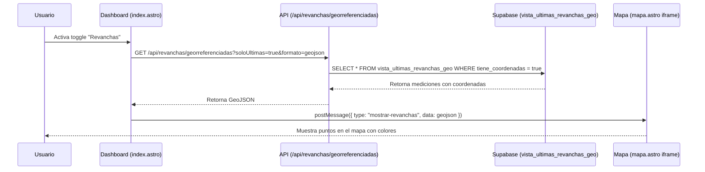

# 🗺️ SISTEMA DE MAPA - DOCUMENTACIÓN COMPLETA

## 🎯 Descripción General

Sistema de visualización geoespacial integrado en el dashboard principal (`index.astro`) que permite visualizar:

- ✅ **Canchas** con estados y colores por empresa
- ✅ **PKs (Progressive Kilometers)** georreferenciados de los muros
- ✅ **Revanchas** con mediciones más recientes por PK
- ✅ **Filtros** por muro (Principal, Este, Oeste)
- ✅ **Toggles** para activar/desactivar capas

---

## 📁 Estructura de Archivos

```
canchas-anglo2/
├── src/
│   ├── pages/
│   │   ├── index.astro                    # Dashboard con mapa integrado
│   │   ├── mapa.astro                     # Página del mapa (iframe)
│   │   └── api/
│   │       ├── revanchas/
│   │       │   └── georreferenciadas.ts   # API de revanchas con coordenadas
│   │       └── pks/
│   │           └── georreferenciados.ts   # API de PKs con coordenadas
└── docs/
    └── database/
        └── migrations/
            └── archive/
                └── SISTEMA_PKS_GEORREFERENCIADOS.sql  # Migración de vistas
```

---

## 🗄️ Esquema de Base de Datos

### Tabla: `pks_maestro`
Tabla maestra con 138 PKs georreferenciados.

| Columna | Tipo | Descripción |
|---------|------|-------------|
| `id` | BIGSERIAL PRIMARY KEY | ID único |
| `muro` | VARCHAR(50) | 'Principal', 'Este', 'Oeste' |
| `pk` | VARCHAR(20) | Progressive Kilometer (ej: '0+000', '0+020') |
| `utm_x` | NUMERIC(12,3) | Coordenada Este UTM Zona 19S (metros) |
| `utm_y` | NUMERIC(12,3) | Coordenada Norte UTM Zona 19S (metros) |
| `lon` | NUMERIC(12,8) | Longitud WGS84 (grados decimales) |
| `lat` | NUMERIC(12,8) | Latitud WGS84 (grados decimales) |
| `activo` | BOOLEAN | Si el PK está activo |
| `notas` | TEXT | Notas adicionales |
| `created_at` | TIMESTAMPTZ | Fecha de creación |
| `updated_at` | TIMESTAMPTZ | Fecha de actualización |

**Constraints:**
- UNIQUE: `(muro, pk)` - Un PK único por muro
- CHECK: `muro IN ('Principal', 'Este', 'Oeste')`

**Distribución:**
- Muro Principal: 73 PKs (0+000 a 1+434)
- Muro Este: 29 PKs (0+000 a 0+551)
- Muro Oeste: 36 PKs (0+000 a 0+690)
- **TOTAL: 138 PKs**

---

### Vista: `vista_revanchas_georreferenciadas`
Une mediciones de revanchas con coordenadas de `pks_maestro`.

**Columnas principales:**
- `medicion_id`, `archivo_id`, `archivo_muro`
- `sector`, `pk`, `fecha_medicion`
- `coronamiento`, `revancha`, `lama`, `ancho`, `geomembrana`
- `dist_geo_lama`, `dist_geo_coronamiento`
- **`lat`, `lon`, `utm_x`, `utm_y`** ← Coordenadas desde `pks_maestro`
- **`tiene_coordenadas`** ← Flag booleano (true/false)
- **`color_revancha`, `color_ancho`, `color_dist_geo`** ← Clasificación por colores

**JOIN Logic:**
```sql
LEFT JOIN pks_maestro pk ON 
    pk.muro = ra.muro 
    AND normalizar_pk(pk.pk) = normalizar_pk(rm.pk)
    AND pk.activo = true
```

**Función `normalizar_pk()`:**
Normaliza PKs con decimales a formato estándar:
- `'0+000.00'` → `'0+000'`
- `'0+020.00'` → `'0+020'`
- `'0+550.80'` → `'0+551'` (redondea)

---

### Vista: `vista_ultimas_revanchas_geo`
Solo las mediciones **más recientes** de cada PK por muro.

**Lógica:**
1. Agrupa por `(archivo_muro, sector, pk)`
2. Selecciona `MAX(fecha_medicion)` de cada grupo
3. Filtra solo registros con `tiene_coordenadas = TRUE`

**Uso:** Esta vista es la que usa el mapa para evitar duplicados.

---

## 🎨 Clasificación por Colores

### Revancha
- 🟢 **Verde**: ≥ 3.5m (seguro)
- 🟡 **Amarillo**: 3.0m - 3.5m (precaución)
- 🔴 **Rojo**: < 3.0m (crítico)

### Ancho de Cubeta
- 🟢 **Verde**: ≥ 18m (seguro)
- 🟡 **Amarillo**: 15m - 18m (precaución)
- 🔴 **Rojo**: < 15m (crítico)

### Distancia Geomembrana-Lama
- 🟢 **Verde**: ≥ 1.0m (seguro)
- 🟡 **Amarillo**: 0.5m - 1.0m (precaución)
- 🔴 **Rojo**: < 0.5m (crítico)

---

## 🔌 API Endpoints

### GET `/api/revanchas/georreferenciadas`

**Descripción:** Obtiene revanchas con coordenadas geográficas.

**Query Parameters:**
- `muro` (opcional): 'Principal' | 'Este' | 'Oeste'
- `fechaDesde` (opcional): YYYY-MM-DD
- `fechaHasta` (opcional): YYYY-MM-DD
- `soloUltimas` (opcional): 'true' | 'false' (default: false)
- `formato` (opcional): 'geojson' | 'json' (default: json)
- `limite` (opcional): número (default: 1000)

**Ejemplo de uso:**
```javascript
// Obtener últimas revanchas en formato GeoJSON
const response = await fetch(
  '/api/revanchas/georreferenciadas?soloUltimas=true&formato=geojson'
);
const geojson = await response.json();
```

**Respuesta GeoJSON:**
```json
{
  "type": "FeatureCollection",
  "features": [
    {
      "type": "Feature",
      "geometry": {
        "type": "Point",
        "coordinates": [-70.7363288, -33.1138232]
      },
      "properties": {
        "medicion_id": 123,
        "archivo_id": 45,
        "muro": "Principal",
        "sector": "1",
        "pk": "0+000",
        "fecha_medicion": "2025-12-15",
        "coronamiento": 1234.56,
        "revancha": 3.8,
        "lama": 1230.76,
        "ancho": 19.5,
        "geomembrana": 1228.5,
        "dist_geo_lama": 2.26,
        "dist_geo_coronamiento": 6.06,
        "color_revancha": "verde",
        "color_ancho": "verde",
        "color_dist_geo": "verde",
        "archivo_nombre": "Principal_15-12-2025.xlsx",
        "created_at": "2025-12-15T10:30:00Z"
      }
    }
  ]
}
```

---

## 🖥️ Frontend: Dashboard Map (`index.astro`)

### Estructura HTML

```html
<div id="dashboard-map-container" class="dashboard-map-container">
  <div class="dashboard-map-header">
    <h3 class="dashboard-map-title">🗺️ Vista de Mapa</h3>
    <p class="dashboard-map-subtitle">Mostrando todas las canchas</p>
  </div>

  <!-- Controles -->
  <div class="dashboard-map-controls">
    <!-- Filtro de Muro -->
    <select id="map-muro-filter">
      <option value="">Todos los muros</option>
      <option value="Principal">Muro Principal</option>
      <option value="Este">Muro Este</option>
      <option value="Oeste">Muro Oeste</option>
    </select>

    <!-- Toggle de PKs -->
    <label class="toggle-label">
      <input type="checkbox" id="toggle-pks" />
      <span>PKs</span>
    </label>

    <!-- Toggle de Revanchas -->
    <label class="toggle-label">
      <input type="checkbox" id="toggle-revanchas" />
      <span>Revanchas</span>
    </label>
  </div>

  <!-- Iframe del Mapa -->
  <iframe src="/mapa" frameborder="0"></iframe>
</div>
```

### JavaScript: Toggle de Revanchas

**Ubicación:** `index.astro` líneas 5250-5320

```javascript
// Toggle de Revanchas
if (toggleRevanchas) {
  toggleRevanchas.addEventListener("change", async (e) => {
    const activado = e.target.checked;
    console.log("📊 Revanchas toggle:", activado ? "ON" : "OFF");

    const mapContainer = document.getElementById("dashboard-map-container");
    const iframe = mapContainer?.querySelector("iframe");

    if (!iframe || !iframe.contentWindow) {
      console.log("⚠️ Iframe del mapa no disponible");
      return;
    }

    if (activado) {
      try {
        console.log("🔄 Cargando revanchas georreferenciadas...");

        // Obtener filtro de muro actual
        const muroFiltro = mapMuroFilter?.value || "";

        // Construir URL con filtros
        let apiUrl = "/api/revanchas/georreferenciadas?soloUltimas=true&formato=geojson";
        if (muroFiltro) {
          apiUrl += `&muro=${muroFiltro}`;
        }

        // Cargar datos de revanchas georreferenciadas
        const response = await fetch(apiUrl);
        if (!response.ok) {
          throw new Error(`Error ${response.status}: ${response.statusText}`);
        }

        const geojsonData = await response.json();
        console.log(`✅ ${geojsonData.features.length} revanchas georreferenciadas cargadas`);

        // Enviar datos al iframe del mapa
        iframe.contentWindow.postMessage(
          {
            type: "mostrar-revanchas",
            data: geojsonData,
          },
          "*"
        );

        console.log("📤 Datos de revanchas enviados al mapa");
      } catch (error) {
        console.error("❌ Error al cargar revanchas:", error);
        alert("Error al cargar revanchas georreferenciadas");
        // Desmarcar el toggle en caso de error
        e.target.checked = false;
      }
    } else {
      // Ocultar capa de revanchas
      iframe.contentWindow.postMessage(
        {
          type: "ocultar-revanchas",
        },
        "*"
      );
      console.log("📤 Comando de ocultar revanchas enviado al mapa");
    }
  });
}
```

---

## 🔄 Flujo de Comunicación



---

## 🛠️ Mantenimiento y Troubleshooting

### Problema: "Error al cargar revanchas georreferenciadas"

**Causa:** La vista `vista_revanchas_georreferenciadas` no tiene la columna `tiene_coordenadas`.

**Solución:**
1. Ejecutar script `scripts/subida_historica_revanchas/CORREGIR_VISTAS_REVANCHAS.sql`
2. Este script:
   - Elimina PKs con formato incorrecto (sin "+")
   - Recrea `vista_revanchas_georreferenciadas` con columna `tiene_coordenadas`
   - Recrea `vista_ultimas_revanchas_geo`

### Verificar que las vistas existen

```sql
-- Ver si las vistas existen
SELECT table_name 
FROM information_schema.views 
WHERE table_schema = 'public' 
AND table_name LIKE '%revanchas%geo%';

-- Verificar columnas de la vista
SELECT column_name, data_type 
FROM information_schema.columns 
WHERE table_name = 'vista_revanchas_georreferenciadas';
```

### Verificar datos de revanchas georreferenciadas

```sql
-- Contar revanchas con coordenadas
SELECT COUNT(*) 
FROM vista_revanchas_georreferenciadas 
WHERE tiene_coordenadas = true;

-- Ver distribución por muro
SELECT archivo_muro, COUNT(*) as total
FROM vista_ultimas_revanchas_geo
GROUP BY archivo_muro;

-- Ver ejemplo de datos
SELECT 
    archivo_muro,
    pk,
    fecha_medicion,
    revancha,
    ancho,
    lat,
    lon,
    color_revancha,
    color_ancho
FROM vista_ultimas_revanchas_geo
LIMIT 10;
```

---

## 📊 Estadísticas del Sistema

### PKs Georreferenciados
- **Total:** 138 PKs
- **Principal:** 73 PKs (0+000 a 1+434)
- **Este:** 29 PKs (0+000 a 0+551)
- **Oeste:** 36 PKs (0+000 a 0+690)

### Mediciones de Revanchas (Ejemplo)
- **Total mediciones:** ~22,913
- **Con coordenadas:** ~22,860+ (>99%)
- **Sin coordenadas:** <1% (PKs no georreferenciados)

---

## 🔐 Permisos y Seguridad

### Acceso a la Vista
- Todos los usuarios autenticados pueden ver el mapa
- Los toggles están disponibles para todos

### Políticas RLS (Row Level Security)
Las vistas heredan las políticas de las tablas base:
- `revanchas_archivos`: Todos pueden leer
- `revanchas_mediciones`: Todos pueden leer
- `pks_maestro`: Todos pueden leer

---

## 📝 Notas Técnicas

### Conversión de Coordenadas
- **Sistema origen:** UTM Zona 19S (EPSG:32719)
- **Sistema destino:** WGS84 (EPSG:4326)
- **Función:** `utm_to_wgs84(utm_x, utm_y, zona, hemisferio)`

### Formato de PKs
- **Estándar:** `"0+000"`, `"0+020"`, `"1+434"`
- **Con decimales:** `"0+000.00"` → normalizado a `"0+000"`
- **Inválidos:** `"736.45"`, `"2.75"` → eliminados

### PostMessage API
El dashboard se comunica con el iframe del mapa mediante `postMessage`:

**Mensajes enviados:**
- `{ type: "mostrar-revanchas", data: geojson }` - Mostrar capa de revanchas
- `{ type: "ocultar-revanchas" }` - Ocultar capa de revanchas
- `{ type: "mostrar-pks", data: geojson }` - Mostrar capa de PKs
- `{ type: "ocultar-pks" }` - Ocultar capa de PKs

---

## 🚀 Futuras Mejoras

- [ ] Animación de pulso en puntos críticos (rojos)
- [ ] Popup con detalles al hacer click en un punto
- [ ] Gráfico de tendencia temporal por PK
- [ ] Exportar datos visibles a CSV/Excel
- [ ] Filtro por rango de fechas
- [ ] Heatmap de revanchas
- [ ] Comparación lado a lado de dos fechas

---

## 📚 Referencias

- **Documentación Mapbox:** https://docs.mapbox.com/
- **GeoJSON Spec:** https://geojson.org/
- **UTM Conversion:** https://en.wikipedia.org/wiki/Universal_Transverse_Mercator_coordinate_system
- **PostMessage API:** https://developer.mozilla.org/en-US/docs/Web/API/Window/postMessage
