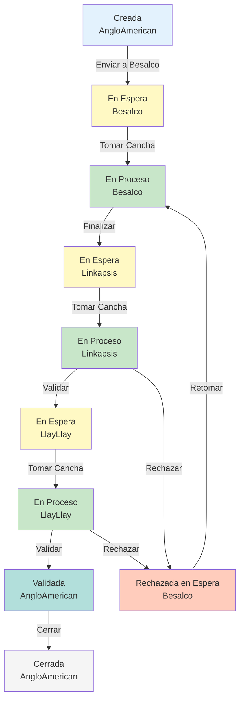

# 🔄 Flujo de Estados del Sistema - ACTUALIZADO

## 📊 Estados Disponibles

| ID | Nombre | Uso Actual | Descripción |
|----|--------|------------|-------------|
| 1 | **Creada** | ✅ ACTIVO | Cancha recién creada por AngloAmerican |
| 2 | **En Proceso** | ✅ ACTIVO | Cancha siendo ejecutada por alguna empresa |
| 3 | ~~Finalizada~~ | ❌ DEPRECADO | No se usa - eliminar en futuro |
| 4 | **Validada** | 🆕 NUEVO USO | Cancha validada por todas las empresas, lista para cierre |
| 5 | ~~Rechazada~~ | ⚠️ DEPRECADO | Reemplazado por estado 8 |
| 6 | **Cerrada** | ✅ ACTIVO | Cancha cerrada definitivamente |
| 7 | **En Espera** | 🆕 NUEVO | Cancha asignada a empresa pero no tomada |
| 8 | **Rechazada, en Espera** | 🆕 NUEVO | Cancha rechazada, en cola para retrabajo |

---

## 🎯 Flujo Completo Paso a Paso

### **1️⃣ Creación (AngloAmerican)**
```
Estado: Creada (id: 1)
Empresa: AngloAmerican (id: 1)
Acción disponible: "Enviar a Besalco"
```

### **2️⃣ Asignación a Besalco**
```
Estado: En Espera (id: 7)
Empresa: Besalco (id: 2)
Acción disponible: "Tomar Cancha" (Besalco)
```

### **3️⃣ Besalco Toma la Cancha**
```
Estado: En Proceso (id: 2)
Empresa: Besalco (id: 2)
Acciones disponibles: 
  - "Finalizar Trabajo" → va a Linkapsis
  - "Rechazar Propio Trabajo" → vuelve a En Espera
```

### **4️⃣ Trabajo Finalizado → Asignación a Linkapsis**
```
Estado: En Espera (id: 7)
Empresa: Linkapsis (id: 3)
Acción disponible: "Tomar Cancha" (Linkapsis)
```

### **5️⃣ Linkapsis Toma la Cancha**
```
Estado: En Proceso (id: 2)
Empresa: Linkapsis (id: 3)
Acciones disponibles:
  - "Validar Espesores" → va a LlayLlay
  - "Rechazar" → vuelve a Besalco (Rechazada, en Espera)
```

### **6A️⃣ Si Linkapsis VALIDA → Asignación a LlayLlay**
```
Estado: En Espera (id: 7)
Empresa: LlayLlay (id: 4)
Acción disponible: "Tomar Cancha" (LlayLlay)
```

### **6B️⃣ Si Linkapsis RECHAZA → Devolución a Besalco**
```
Estado: Rechazada, en Espera (id: 8)
Empresa: Besalco (id: 2)
Acción disponible: "Retomar Cancha" (Besalco)
```

### **7️⃣ LlayLlay Toma la Cancha**
```
Estado: En Proceso (id: 2)
Empresa: LlayLlay (id: 4)
Acciones disponibles:
  - "Validar Densidad" → vuelve a AngloAmerican (Validada)
  - "Rechazar" → vuelve a Besalco (Rechazada, en Espera)
```

### **8A️⃣ Si LlayLlay VALIDA → Completamente Validada**
```
Estado: Validada (id: 4)
Empresa: AngloAmerican (id: 1)
Acción disponible: "Cerrar Cancha" (AngloAmerican)
```

### **8B️⃣ Si LlayLlay RECHAZA → Devolución a Besalco**
```
Estado: Rechazada, en Espera (id: 8)
Empresa: Besalco (id: 2)
Acción disponible: "Retomar Cancha" (Besalco)
```

### **9️⃣ Cierre Final (AngloAmerican)**
```
Estado: Cerrada (id: 6)
Empresa: AngloAmerican (id: 1)
Acción disponible: Ninguna (flujo terminado)
```

---

## 🔀 Diagrama de Transiciones



---

## 🎨 Colores Sugeridos para Estados (Frontend)

```css
/* Creada - Azul claro */
.estado-creada {
  background: #e3f2fd;
  color: #1565c0;
}

/* En Espera - Amarillo */
.estado-en-espera {
  background: #fff9c4;
  color: #f57f17;
}

/* En Proceso - Verde */
.estado-en-proceso {
  background: #c8e6c9;
  color: #2e7d32;
}

/* Rechazada, en Espera - Naranja */
.estado-rechazada-en-espera {
  background: #ffccbc;
  color: #d84315;
}

/* Validada - Verde azulado */
.estado-validada {
  background: #b2dfdb;
  color: #00695c;
}

/* Cerrada - Gris */
.estado-cerrada {
  background: #f5f5f5;
  color: #424242;
}
```

---

## 🔧 Acciones por Empresa y Estado

### **AngloAmerican**
| Estado Actual | Empresa Actual | Acción Disponible |
|---------------|----------------|-------------------|
| Creada | AngloAmerican | Enviar a Besalco |
| Validada | AngloAmerican | Cerrar Cancha |
| Cerrada | AngloAmerican | (ninguna) |

### **Besalco**
| Estado Actual | Empresa Actual | Acción Disponible |
|---------------|----------------|-------------------|
| En Espera | Besalco | Tomar Cancha |
| En Proceso | Besalco | Finalizar Trabajo / Rechazar |
| Rechazada, en Espera | Besalco | Retomar Cancha |

### **Linkapsis**
| Estado Actual | Empresa Actual | Acción Disponible |
|---------------|----------------|-------------------|
| En Espera | Linkapsis | Tomar Cancha |
| En Proceso | Linkapsis | Validar Espesores / Rechazar |

### **LlayLlay**
| Estado Actual | Empresa Actual | Acción Disponible |
|---------------|----------------|-------------------|
| En Espera | LlayLlay | Tomar Cancha |
| En Proceso | LlayLlay | Validar Densidad / Rechazar |

---

## 📝 Notas Importantes

1. **Estado "En Espera" vs "En Proceso"**:
   - **En Espera**: La cancha está en la cola de la empresa, aún no la están trabajando
   - **En Proceso**: La empresa activamente está trabajando en la cancha

2. **Diferencia "Rechazada" vs "Rechazada, en Espera"**:
   - Ya no usamos el estado "Rechazada" (id: 5) simple
   - Ahora todo rechazo va a "Rechazada, en Espera" (id: 8) indicando que está en cola para retrabajo

3. **Estado "Validada"**:
   - Solo se usa cuando la cancha completó TODO el ciclo (Besalco → Linkapsis → LlayLlay)
   - Indica que está lista para el cierre por AngloAmerican
   - Es el único estado que permite la acción "Cerrar Cancha"

4. **Botones Nuevos Necesarios**:
   - 🆕 "Tomar Cancha" (estado: En Espera → En Proceso)
   - 🆕 "Retomar Cancha" (estado: Rechazada en Espera → En Proceso)

---

## ✅ Próximos Pasos de Implementación

### 1. **Backend (Supabase)**
- [x] Ejecutar `migracion_nuevos_estados.sql`
- [ ] Actualizar funciones en `supabase.ts`:
  - `enviarBesalco()` → cambiar a estado 7 (En Espera)
  - `tomarCancha()` → nueva función para 7→2
  - `finalizarBesalco()` → cambiar a estado 7 (En Espera) con empresa Linkapsis
  - `validarLinkapsis()` → cambiar a estado 7 (En Espera) con empresa LlayLlay
  - `rechazarLinkapsis()` → cambiar a estado 8 (Rechazada en Espera)
  - `validarLlayLlay()` → cambiar a estado 4 (Validada) con empresa AngloAmerican
  - `rechazarLlayLlay()` → cambiar a estado 8 (Rechazada en Espera)
  - `cerrarCancha()` → solo permitir si estado = 4 (Validada)

### 2. **Frontend (index.astro)**
- [ ] Actualizar lógica de filtros (`filtrarPorAccionesDisponibles`)
- [ ] Agregar botones "Tomar Cancha" y "Retomar Cancha"
- [ ] Actualizar estilos CSS para nuevos estados
- [ ] Actualizar condiciones de botones en `generarBotonesAccion()`

### 3. **Visualización del Mapa**
- [ ] Agregar colores por estado en el mapa dashboard
- [ ] Leyenda de colores según el estado

---

## 🎯 Resultado Esperado

Después de la implementación completa:
- ✅ Clara distinción entre "asignado" y "ejecutando"
- ✅ Visibilidad de canchas en cola vs activas
- ✅ Mejor trazabilidad del flujo
- ✅ Estado "Validada" indica completitud antes del cierre
- ✅ Menos confusión con estados intermedios
