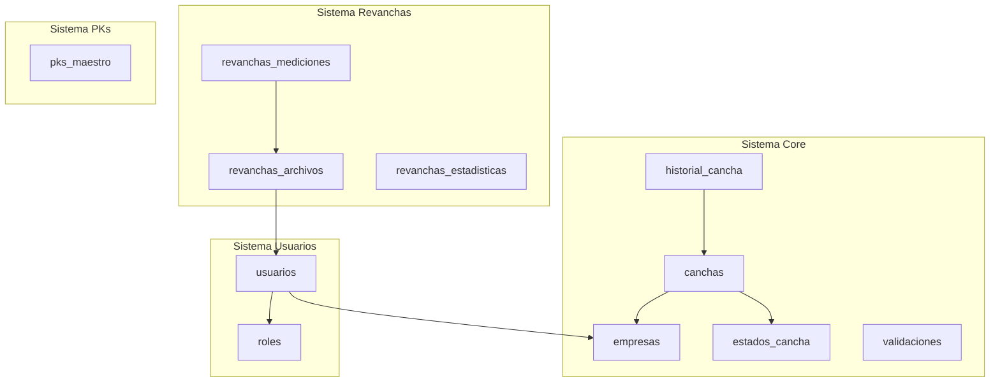

# 🗄️ Database Documentation

Documentación completa de la base de datos PostgreSQL (Supabase) del Sistema de Gestión de Canchas AngloAmerican.

## 📊 Resumen General

- **Base de Datos**: PostgreSQL 15+ (Supabase)
- **Total de Tablas**: 15
- **Total de Vistas**: 12
- **Total de Funciones**: 10
- **Total de Triggers**: 8

## 🏗️ Arquitectura de Datos

### Sistemas Principales



## 📁 Estructura de Documentación

```
database/
├── README.md (este archivo)
├── schemas/                    # Esquemas de tablas
│   ├── core/                  # Sistema principal de canchas
│   ├── usuarios/              # Sistema de usuarios y roles
│   ├── revanchas/             # Sistema de mediciones
│   └── pks/                   # Sistema de PKs georreferenciados
├── views/                      # Vistas de base de datos
├── functions/                  # Funciones y procedimientos
├── triggers/                   # Triggers automáticos
├── relationships/              # Diagramas ER y relaciones
├── migrations/                 # Historial de migraciones
├── queries/                    # Queries útiles
└── security/                   # Políticas RLS

```

## 🎯 Sistemas de Datos

### 1. Sistema Core (Canchas)

**Propósito**: Gestión del flujo principal de canchas a través de estados y empresas.

**Tablas**:
- [`empresas`](./schemas/core/empresas.md) - 4 empresas: AngloAmerican, Besalco, Linkapsis, LlayLlay
- [`estados_cancha`](./schemas/core/estados_cancha.md) - 6 estados del flujo
- [`canchas`](./schemas/core/canchas.md) - Tabla principal con 12 columnas
- [`historial_cancha`](./schemas/core/historial_cancha.md) - Trazabilidad completa
- [`transiciones_estado`](./schemas/core/transiciones_estado.md) - Registro de transiciones
- [`validaciones`](./schemas/core/validaciones.md) - Validaciones por empresa
- [`contador_informes`](./schemas/core/contador_informes.md) - Numeración de informes

**Flujo de Estados**:
```
Creada → En Proceso → Finalizada → Validada → Cerrada
                           ↓
                      Rechazada (vuelve a En Proceso)
```

### 2. Sistema de Usuarios

**Propósito**: Autenticación, autorización y gestión de usuarios.

**Tablas**:
- [`usuarios`](./schemas/usuarios/usuarios.md) - Usuarios del sistema
- [`roles`](./schemas/usuarios/roles.md) - Roles por empresa

**Vistas**:
- `vista_usuarios_completa` - Usuarios con empresa y rol

### 3. Sistema de Revanchas

**Propósito**: Gestión de mediciones de revanchas con archivos CSV/XLSX.

**Tablas**:
- [`revanchas_archivos`](./schemas/revanchas/revanchas_archivos.md) - Metadata de archivos subidos
- [`revanchas_mediciones`](./schemas/revanchas/revanchas_mediciones.md) - Mediciones individuales
- [`revanchas_comparaciones`](./schemas/revanchas/revanchas_comparaciones.md) - Comparaciones entre fechas
- [`revanchas_estadisticas`](./schemas/revanchas/revanchas_estadisticas.md) - Estadísticas globales
- [`revanchas_estadisticas_sector`](./schemas/revanchas/revanchas_estadisticas_sector.md) - Estadísticas por sector

**Vistas**:
- `vista_revanchas_georreferenciadas` - Mediciones con coordenadas
- `vista_ultimas_revanchas_geo` - Solo mediciones más recientes
- `vista_resumen_revanchas_geo` - Estadísticas agregadas

**Triggers Automáticos**:
- Cálculo automático de estadísticas al insertar/eliminar mediciones

### 4. Sistema de PKs Georreferenciados

**Propósito**: 138 puntos fijos georreferenciados del tranque con conversión UTM ↔ WGS84.

**Tablas**:
- [`pks_maestro`](./schemas/pks/pks_maestro.md) - 138 PKs con coordenadas

**Distribución**:
- **Muro Principal**: 73 PKs (0+000 a 1+434)
- **Muro Este**: 29 PKs (0+000 a 0+551)
- **Muro Oeste**: 36 PKs (0+000 a 0+690)

**Funciones**:
- `utm_to_wgs84()` - Conversión de coordenadas UTM Zona 19S a WGS84
- `normalizar_pk()` - Normalización de formato de PKs

## 🔗 Relaciones Principales

### Foreign Keys

```
canchas
  ├─→ empresas (empresa_actual_id)
  ├─→ empresas (created_by)
  └─→ estados_cancha (estado_actual_id)

historial_cancha
  ├─→ canchas (cancha_id) [ON DELETE CASCADE]
  ├─→ empresas (empresa_anterior_id, empresa_nueva_id, created_by)
  └─→ estados_cancha (estado_anterior_id, estado_nuevo_id)

usuarios
  ├─→ empresas (empresa_id) [ON DELETE CASCADE]
  └─→ roles (rol_id) [ON DELETE RESTRICT]

revanchas_mediciones
  └─→ revanchas_archivos (archivo_id) [ON DELETE CASCADE]

revanchas_archivos
  └─→ usuarios (usuario_id)
```

Ver [diagrama completo de relaciones](./relationships/DIAGRAM.md)

## 📋 Vistas Disponibles

| Vista | Propósito |
|-------|-----------|
| `vista_canchas_completa` | Canchas con nombres de estado y empresa |
| `vista_historial_completa` | Historial con nombres legibles |
| `vista_transiciones_completa` | Transiciones de estado detalladas |
| `vista_usuarios_completa` | Usuarios con empresa y rol |
| `vista_revanchas_georreferenciadas` | Mediciones con coordenadas WGS84 |
| `vista_ultimas_revanchas_geo` | Última medición por PK |
| `vista_resumen_revanchas_geo` | Estadísticas por muro/fecha |
| `vista_pks_completa` | PKs activos ordenados |
| `vista_pks_por_muro` | Resumen de PKs por muro |
| `vista_mediciones_completas` | Mediciones con clasificación de colores |
| `vista_comparacion_ultimas_mediciones` | Comparación última vs penúltima |
| `vista_ultimas_mediciones` | Última medición por muro |

## ⚙️ Funciones y Triggers

### Funciones Principales

| Función | Propósito |
|---------|-----------|
| `utm_to_wgs84()` | Conversión UTM Zona 19S → WGS84 |
| `normalizar_pk()` | Normaliza formato de PKs (0+550.800 → 0+551) |
| `calcular_estadisticas_archivo()` | Calcula estadísticas de revanchas |
| `registrar_cambio_cancha()` | Registra cambios en historial |
| `update_updated_at_column()` | Actualiza timestamp updated_at |
| `calcular_wgs84_pks()` | Calcula lon/lat al insertar PK |

### Triggers Activos

| Trigger | Tabla | Evento | Función |
|---------|-------|--------|---------|
| `trigger_update_canchas_updated_at` | canchas | BEFORE UPDATE | `update_updated_at_column()` |
| `trigger_cambio_cancha` | canchas | AFTER UPDATE | `registrar_cambio_cancha()` |
| `trigger_calcular_estadisticas_insert` | revanchas_mediciones | AFTER INSERT | `calcular_estadisticas_archivo()` |
| `trigger_calcular_estadisticas_delete` | revanchas_mediciones | AFTER DELETE | `calcular_estadisticas_archivo()` |
| `trigger_calcular_wgs84` | pks_maestro | BEFORE INSERT/UPDATE | `calcular_wgs84_pks()` |

## 🔒 Seguridad (RLS)

Todas las tablas principales tienen **Row Level Security (RLS)** habilitado con políticas permisivas:

- **Lectura**: Permitida para todos (`FOR SELECT USING (true)`)
- **Escritura**: Permitida para todos (`FOR ALL USING (true)`)

> **Nota**: Las políticas actuales son permisivas para desarrollo. En producción se deben implementar políticas más restrictivas basadas en roles y empresas.

Ver [documentación completa de RLS](./security/RLS_POLICIES.md)

## 📊 Índices de Performance

### Índices Principales

**canchas**:
- `unique_cancha_components` (muro, sector, nombre_detalle)
- `uk_canchas_numero_informe` (numero_informe)
- `idx_canchas_numero_informe` (numero_informe)

**pks_maestro**:
- `unique_muro_pk` (muro, pk)
- `idx_pks_muro_pk` (muro, pk)
- `idx_pks_utm_coords` (utm_x, utm_y)
- `idx_pks_wgs84_coords` (lon, lat)
- `idx_pks_activo` (activo) WHERE activo = true

**revanchas_mediciones**:
- `unique_archivo_sector_pk` (archivo_id, sector, pk)
- `idx_revanchas_mediciones_archivo` (archivo_id)
- `idx_revanchas_mediciones_sector_pk` (sector, pk)

**usuarios**:
- `usuarios_nombre_completo_empresa_id_key` (nombre_completo, empresa_id)
- `idx_usuarios_empresa_id` (empresa_id)
- `idx_usuarios_rol_id` (rol_id)
- `idx_usuarios_activo` (activo)

## 🚀 Inicio Rápido

### 1. Consultas Comunes

```sql
-- Obtener todas las canchas con información completa
SELECT * FROM vista_canchas_completa;

-- Obtener historial de una cancha
SELECT * FROM vista_historial_completa WHERE cancha_nombre = 'MP_S5_TALUD';

-- Obtener últimas mediciones georreferenciadas
SELECT * FROM vista_ultimas_revanchas_geo;

-- Obtener PKs de un muro específico
SELECT * FROM pks_maestro WHERE muro = 'Principal' AND activo = true;
```

Ver más en [queries/common_operations.md](./queries/common_operations.md)

### 2. Ejecutar Diagnóstico

Para obtener información completa del schema actual:

```bash
# Ejecutar en Supabase SQL Editor
psql -f DIAGNOSTICO_SCHEMA_COMPLETO.sql
```

### 3. Migraciones

Ver historial completo de migraciones en [migrations/HISTORY.md](./migrations/HISTORY.md)

## 📖 Documentación Detallada

### Por Sistema

- [Sistema Core (Canchas)](./schemas/core/)
- [Sistema de Usuarios](./schemas/usuarios/)
- [Sistema de Revanchas](./schemas/revanchas/)
- [Sistema de PKs](./schemas/pks/)

### Por Tipo

- [Todas las Tablas](./schemas/)
- [Todas las Vistas](./views/)
- [Todas las Funciones](./functions/)
- [Todos los Triggers](./triggers/)
- [Relaciones y Diagramas](./relationships/)

### Recursos

- [Queries Útiles](./queries/)
- [Políticas de Seguridad](./security/)
- [Historial de Migraciones](./migrations/)

## 🔧 Mantenimiento

### Backup

```sql
-- Ejecutar backup completo
-- Ver: migrations/archive/backup-supabase.sql
```

### Verificación de Integridad

```sql
-- Verificar foreign keys
SELECT * FROM information_schema.table_constraints 
WHERE constraint_type = 'FOREIGN KEY';

-- Verificar triggers activos
SELECT * FROM information_schema.triggers 
WHERE trigger_schema = 'public';
```

## 📝 Convenciones

### Nomenclatura

- **Tablas**: snake_case, plural cuando corresponde
- **Columnas**: snake_case
- **Vistas**: prefijo `vista_`, snake_case
- **Funciones**: snake_case, verbo descriptivo
- **Triggers**: prefijo `trigger_`, snake_case
- **Índices**: prefijo `idx_` o `unique_`, snake_case

### Timestamps

Todas las tablas principales incluyen:
- `created_at TIMESTAMPTZ DEFAULT NOW()`
- `updated_at TIMESTAMPTZ DEFAULT NOW()` (con trigger automático)

### IDs

- Todas las tablas usan `id SERIAL PRIMARY KEY`
- Las secuencias se generan automáticamente

## 🤝 Contribuir

Al modificar el schema:

1. Ejecutar migración en Supabase
2. Actualizar documentación correspondiente
3. Ejecutar `DIAGNOSTICO_SCHEMA_COMPLETO.sql` para verificar
4. Actualizar este README si es necesario
5. Documentar en `migrations/HISTORY.md`

## 📞 Soporte

Para preguntas sobre la base de datos:
1. Revisar esta documentación
2. Consultar queries de ejemplo
3. Revisar código de API endpoints en `src/pages/api/`

---

**Última actualización**: 2025-12-22  
**Versión del Schema**: 1.0  
**Mantenedores**: Equipo de Desarrollo
