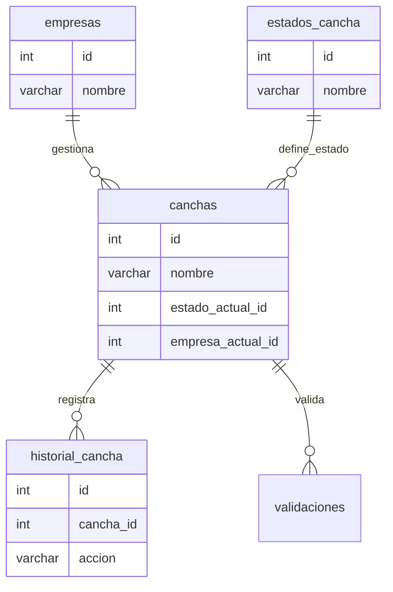

# Diagrama de Relaciones (ER Diagram)

## Diagrama Completo del Sistema

```mermaid
erDiagram
    empresas ||--o{ canchas : "empresa_actual"
    empresas ||--o{ canchas : "created_by"
    empresas ||--o{ historial_cancha : "empresa_anterior"
    empresas ||--o{ historial_cancha : "empresa_nueva"
    empresas ||--o{ historial_cancha : "created_by"
    empresas ||--o{ usuarios : "pertenece"
    empresas ||--o{ roles : "tiene"
    empresas ||--o{ validaciones : "valida"
    empresas ||--o{ transiciones_estado : "empresa_anterior"
    empresas ||--o{ transiciones_estado : "empresa_nueva"
    
    estados_cancha ||--o{ canchas : "estado_actual"
    estados_cancha ||--o{ historial_cancha : "estado_anterior"
    estados_cancha ||--o{ historial_cancha : "estado_nuevo"
    estados_cancha ||--o{ transiciones_estado : "estado_anterior"
    estados_cancha ||--o{ transiciones_estado : "estado_nuevo"
    
    canchas ||--o{ historial_cancha : "tiene_historial"
    canchas ||--o{ validaciones : "tiene_validaciones"
    canchas ||--o{ transiciones_estado : "tiene_transiciones"
    
    roles ||--o{ usuarios : "tiene_rol"
    
    usuarios ||--o{ revanchas_archivos : "sube_archivos"
    usuarios ||--o{ validaciones : "valida"
    usuarios ||--o{ transiciones_estado : "ejecuta"
    
    revanchas_archivos ||--o{ revanchas_mediciones : "contiene"
    revanchas_archivos ||--o{ revanchas_estadisticas : "tiene_estadisticas"
    revanchas_archivos ||--o{ revanchas_estadisticas_sector : "tiene_estadisticas_sector"
    revanchas_archivos ||--o{ revanchas_comparaciones : "archivo_anterior"
    revanchas_archivos ||--o{ revanchas_comparaciones : "archivo_actual"
    
    empresas {
        int id PK
        varchar nombre UK
        timestamptz created_at
    }
    
    estados_cancha {
        int id PK
        varchar nombre UK
        text descripcion
        timestamptz created_at
    }
    
    canchas {
        int id PK
        varchar nombre UK
        varchar muro
        varchar sector
        varchar nombre_detalle
        int estado_actual_id FK
        int empresa_actual_id FK
        int created_by FK
        timestamptz created_at
        timestamptz updated_at
        int numero_informe UK
        jsonb poligono_coordenadas
    }
    
    historial_cancha {
        int id PK
        int cancha_id FK
        int estado_anterior_id FK
        int estado_nuevo_id FK
        int empresa_anterior_id FK
        int empresa_nueva_id FK
        varchar accion
        text observaciones
        int created_by FK
        timestamptz created_at
    }
    
    transiciones_estado {
        int id PK
        int cancha_id FK
        int estado_anterior_id FK
        int estado_nuevo_id FK
        int empresa_anterior_id FK
        int empresa_nueva_id FK
        int usuario_id FK
        varchar accion
        text observaciones
        timestamptz created_at
    }
    
    validaciones {
        int id PK
        int cancha_id FK
        int empresa_validadora_id FK
        int usuario_validador_id FK
        varchar tipo_validacion
        varchar resultado
        text observaciones
        jsonb mediciones
        boolean is_revalidacion
        timestamptz created_at
    }
    
    roles {
        int id PK
        varchar nombre
        int empresa_id FK
        text descripcion
        timestamptz created_at
    }
    
    usuarios {
        int id PK
        varchar nombre_completo
        varchar email
        int empresa_id FK
        int rol_id FK
        boolean activo
        varchar password_hash
        timestamptz created_at
        timestamptz updated_at
    }
    
    pks_maestro {
        int id PK
        varchar muro
        varchar pk UK
        numeric utm_x
        numeric utm_y
        int utm_zona
        char utm_hemisferio
        numeric lon
        numeric lat
        text descripcion
        boolean activo
        timestamptz created_at
        timestamptz updated_at
    }
    
    revanchas_archivos {
        int id PK
        varchar muro
        date fecha_medicion UK
        varchar archivo_nombre
        varchar archivo_tipo
        int total_registros
        text[] sectores_incluidos
        int usuario_id FK
        timestamptz created_at
        timestamptz updated_at
    }
    
    revanchas_mediciones {
        int id PK
        int archivo_id FK
        varchar sector
        varchar pk
        numeric coronamiento
        numeric revancha
        numeric lama
        numeric ancho
        numeric geomembrana
        numeric dist_geo_lama
        numeric dist_geo_coronamiento
        timestamptz created_at
    }
    
    revanchas_estadisticas {
        int id PK
        int archivo_id FK UK
        numeric revancha_min
        numeric revancha_max
        numeric revancha_promedio
        varchar revancha_pk_min
        varchar revancha_pk_max
        numeric ancho_min
        numeric ancho_max
        numeric ancho_promedio
        varchar ancho_pk_min
        varchar ancho_pk_max
        numeric coronamiento_min
        numeric coronamiento_max
        numeric coronamiento_promedio
        varchar coronamiento_pk_min
        varchar coronamiento_pk_max
        timestamptz created_at
    }
    
    revanchas_estadisticas_sector {
        int id PK
        int archivo_id FK
        varchar sector
        numeric revancha_min
        numeric revancha_max
        varchar revancha_pk_min
        varchar revancha_pk_max
        numeric ancho_min
        numeric ancho_max
        varchar ancho_pk_min
        varchar ancho_pk_max
        numeric coronamiento_min
        numeric coronamiento_max
        varchar coronamiento_pk_min
        varchar coronamiento_pk_max
        timestamptz created_at
    }
    
    revanchas_comparaciones {
        int id PK
        int archivo_anterior_id FK
        int archivo_actual_id FK
        varchar sector
        varchar pk
        numeric diff_coronamiento
        numeric diff_revancha
        numeric diff_lama
        numeric diff_ancho
        boolean alerta_revancha
        boolean alerta_ancho
        boolean alerta_coronamiento
        timestamptz created_at
    }
```

## Relaciones por Sistema

### Sistema Core



### Sistema Revanchas

```mermaid
erDiagram
    usuarios ||--o{ revanchas_archivos : "sube"
    revanchas_archivos ||--o{ revanchas_mediciones : "contiene"
    revanchas_archivos ||--|| revanchas_estadisticas : "calcula"
    revanchas_archivos ||--o{ revanchas_estadisticas_sector : "calcula_por_sector"
    pks_maestro ||--o{ revanchas_mediciones : "georreferencia"
    
    usuarios {
        int id
        varchar nombre_completo
    }
    
    revanchas_archivos {
        int id
        varchar muro
        date fecha_medicion
        int usuario_id
    }
    
    revanchas_mediciones {
        int id
        int archivo_id
        varchar pk
        numeric revancha
        numeric ancho
    }
    
    pks_maestro {
        int id
        varchar muro
        varchar pk
        numeric lon
        numeric lat
    }
```

## Reglas de Integridad Referencial

### ON DELETE CASCADE

Estas relaciones eliminan registros hijos automáticamente:

- `historial_cancha.cancha_id` → `canchas.id`
- `validaciones.cancha_id` → `canchas.id`
- `transiciones_estado.cancha_id` → `canchas.id`
- `revanchas_mediciones.archivo_id` → `revanchas_archivos.id`
- `revanchas_estadisticas.archivo_id` → `revanchas_archivos.id`
- `revanchas_estadisticas_sector.archivo_id` → `revanchas_archivos.id`
- `usuarios.empresa_id` → `empresas.id`
- `roles.empresa_id` → `empresas.id`

### ON DELETE RESTRICT

Estas relaciones previenen eliminación si existen registros hijos:

- `usuarios.rol_id` → `roles.id`

### ON DELETE SET NULL

Estas relaciones establecen NULL al eliminar el padre:

- `validaciones.usuario_validador_id` → `usuarios.id`

### ON DELETE NO ACTION (default)

Todas las demás relaciones usan el comportamiento por defecto de PostgreSQL.

## Constraints Únicos

### Tablas Core

- `empresas.nombre` - Nombre único de empresa
- `estados_cancha.nombre` - Nombre único de estado
- `canchas.nombre` - Nombre único de cancha
- `canchas(muro, sector, nombre_detalle)` - Combinación única
- `canchas.numero_informe` - Número de informe único

### Tablas Revanchas

- `revanchas_archivos(muro, fecha_medicion)` - Un archivo por muro por fecha
- `revanchas_mediciones(archivo_id, sector, pk)` - Una medición por PK por archivo
- `revanchas_estadisticas.archivo_id` - Una estadística global por archivo
- `revanchas_estadisticas_sector(archivo_id, sector)` - Una estadística por sector por archivo
- `revanchas_comparaciones(archivo_anterior_id, archivo_actual_id, sector, pk)` - Una comparación única

### Tablas PKs

- `pks_maestro(muro, pk)` - Un PK único por muro

### Tablas Usuarios

- `usuarios(nombre_completo, empresa_id)` - Nombre único por empresa
- `roles(nombre, empresa_id)` - Rol único por empresa

## Índices de Performance

Ver documentación completa en [../README.md](../README.md#-índices-de-performance)
