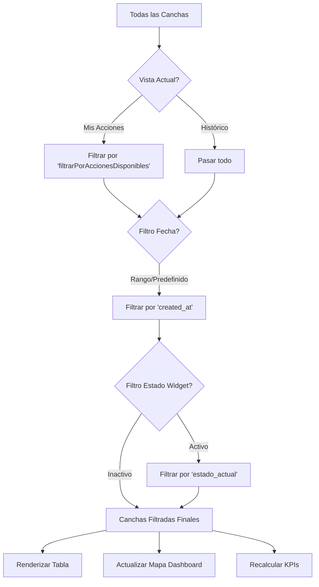

# Documentación: Filtros y Estadísticas del Dashboard

Esta sección detalla el funcionamiento de los controles de filtrado y los componentes estadísticos del dashboard principal en `src/pages/index.astro`.

## 1. Sistema de Filtros

El dashboard utiliza un sistema de filtrado en cascada que procesa la lista completa de canchas (`todasLasCanchas`) para generar la vista actual (`canchasFiltradas`).

### Control de Vista ("Mis Acciones" vs "Ver Histórico")
Ubicación: `.toggle-container` (HTML) / `cambiarVista()` (JS)

Permite alternar entre dos modos principales:
1.  **Mis Acciones (`vistaActual = 'acciones'`):**
    *   Muestra solo las canchas que requieren intervención inmediata de la empresa logueada.
    *   Lógica definida en `filtrarPorAccionesDisponibles()`.
    *   *Ejemplo:* Para Besalco, muestra canchas en estado "En Espera" o "En Proceso" asignadas a Besalco.
2.  **Ver Histórico (`vistaActual = 'historico'`):**
    *   Muestra todas las canchas disponibles, sujeto a los filtros de fecha y estado.
    *   Ideal para búsquedas y revisión de registros pasados.

### Filtro de Fecha
Ubicación: `#filtro-fecha` (Select) / `filtrarPorFecha()` (JS)

Filtra las canchas según su fecha de creación (`created_at`).

| Opción | Lógica |
| :--- | :--- |
| **Todas las fechas** | Sin filtro (`all`). |
| **Hoy** | `fechaCancha >= inicio del día actual`. |
| **Última semana** | `fechaCancha >= hace 7 días`. |
| **Último mes** | `fechaCancha >= hace 30 días`. |
| **Rango personalizado** | `fechaCancha >= Desde` AND `fechaCancha <= Hasta`. Activa los inputs `#fecha-desde` y `#fecha-hasta`. |

### Filtro de Estado (Widgets Circulares)
Ubicación: `.estado-widget` / `filtrarPorEstadoWidget()` (JS)

*   **Interacción:** Doble click en un widget circular filtra la tabla para mostrar solo ese estado específico.
*   **Visualización:** El widget seleccionado se resalta, mientras que los demás se atenúan (`.dimmed`).
*   **Lógica:** Aplica un filtro exacto sobre `estado_actual`.

---

## 2. Indicadores y Estadísticas (KPIs)

Los indicadores se actualizan dinámicamente cada vez que se aplican filtros (`aplicarFiltros()`), llamando a `actualizarContadorResultados()`.

### Keycards (Sidebar Derecho)

#### ⚙️ Acciones Disponibles (`#stat-acciones`)
*   **Definición:** Cantidad de canchas dentro de la **vista filtrada actual** que requieren acción del usuario.
*   **Dependencia:** Es sensible a los filtros de fecha. Si filtras "Hoy", solo contará acciones pendientes de canchas creadas hoy.
*   **Cálculo:** `canchasFiltradas.filter(tieneAccion)`

#### 📋 Total de Canchas (`#stat-total`)
*   **Definición:** Cantidad total absoluta de canchas cargadas en el sistema.
*   **Independencia:** **NO** se ve afectado por los filtros de vista o fecha. Siempre muestra el universo total de registros.
*   **Cálculo:** `todasLasCanchas.length`

### Dashboard de Estados (Widgets Circulares)

Muestra el desglose de canchas por estado dentro de la **vista actual filtrada**.

*   **Contadores:** Se recalculan iterando sobre `canchasFiltradas`.
*   **Estados Rastreados:**
    *   Creada
    *   En Espera
    *   En Proceso
    *   Validada
    *   Rechazada, en Espera
    *   Cerrada

---

## 3. Flujo de Ejecución (Pipeline de Filtrado)

Cada vez que un usuario interactúa con un control, se ejecuta `aplicarFiltros()`, siguiendo este orden:

## 4. Archivos Relacionados
*   **Lógica Principal:** `src/pages/index.astro` (Script block)
*   **Estilos:** `src/pages/index.astro` (Estilos CSS para `.filtros-container`, `.stat-card`, `.dashboard-estados`)
