# 📚 Documentación Técnica - MiningMap Component

## 🎯 Descripción General

El componente `MiningMap.astro` es una implementación completa de un mapa interactivo especializado para aplicaciones mineras. Combina visualización de ortomosaicos, datos vectoriales GIS y una interfaz de usuario moderna.

## 🏗️ Arquitectura del Componente

### Estructura del Archivo

```astro
<!-- MiningMap.astro -->
<style>
  /* Estilos CSS con diseño moderno */
</style>

<div class="map-container">
  <!-- HTML estructura del mapa -->
</div>

<script>
  /* JavaScript para funcionalidad del mapa */
</script>
```

## ⚙️ Configuraciones Principales

### 1. Configuración del Mapa

```javascript
const MAP_CONFIG = {
  center: [-70.7376, -33.1193],  // Centro en Las Tórtolas
  zoom: 15,                      // Zoom inicial
  bounds: [
    [-70.762292, -33.136471],    // Límite suroeste
    [-70.708471, -33.111063]     // Límite noreste
  ]
};
```

### 2. Coordenadas UTM de Muros

```javascript
const MURO_BOUNDS_UTM = {
  MP: {
    southwest: [336060.6, 6333765.9],
    northeast: [338308.8, 6335338.4]
  },
  ME: {
    southwest: [339617.2, 6333366.6],
    northeast: [340188.5, 6334496.9]
  },
  MO: {
    southwest: [337253.4, 6332956.2],
    northeast: [338891.7, 6334128.9]
  }
};
```

### 3. Estilos de Polígonos

```javascript
const POLYGON_STYLES = {
  muro: {
    stroke: '#ff7f00',     // Color naranjo
    width: 2,              // Grosor de línea
    opacity: 0.8           // Transparencia
  },
  sector: {
    fill: 'rgba(59, 130, 246, 0.2)',    // Relleno azul claro
    stroke: '#3b82f6',                   // Borde azul
    width: 1                             // Grosor del borde
  }
};
```

## 🔧 Clases y Funciones Principales

### 1. GISDataManager

Clase principal para manejo de datos geoespaciales:

```javascript
class GISDataManager {
  async loadGeoPackageData(path) {
    // Carga datos desde archivos .gpkg
  }
  
  convertToGeoJSON(features) {
    // Convierte features a formato GeoJSON
  }
  
  async getPolygonsData() {
    // Obtiene datos de polígonos de muros
  }
  
  async getSectorsData() {
    // Obtiene datos de sectores
  }
}
```

### 2. Conversión de Coordenadas

```javascript
function utmToWgs84(x, y) {
  // Convierte coordenadas UTM 19S a WGS84
  const utm19s = '+proj=utm +zone=19 +south +datum=WGS84 +units=m +no_defs';
  const wgs84 = '+proj=longlat +datum=WGS84 +no_defs';
  return proj4(utm19s, wgs84, [x, y]);
}
```

### 3. Inicialización del Mapa

```javascript
async function initializeMap() {
  // 1. Obtener token de Mapbox
  const token = await getMapboxToken();
  
  // 2. Crear instancia del mapa
  map = new mapboxgl.Map({
    container: 'map',
    style: { /* estilo personalizado */ },
    center: MAP_CONFIG.center,
    zoom: MAP_CONFIG.zoom,
    maxBounds: MAP_CONFIG.bounds
  });
  
  // 3. Cargar datos GIS
  await loadGISData();
  
  // 4. Configurar eventos y controles
  setupMapEvents();
  setupControls();
}
```

## 📊 Flujo de Datos

### 1. Carga de Datos

```mermaid
graph TD
    A[Inicialización] --> B[Cargar Token Mapbox]
    B --> C[Crear Mapa Base]
    C --> D[Cargar Datos GPKG]
    D --> E[Convertir a GeoJSON]
    E --> F[Agregar Fuentes al Mapa]
    F --> G[Crear Capas Visuales]
    G --> H[Configurar Eventos]
```



### 2. Fuentes de Datos

```javascript
// Ortomosaico desde TileServer GL
map.addSource('ortomosaico', {
  type: 'raster',
  tiles: ['http://localhost:8081/data/mapbase/{z}/{x}/{y}.jpg'],
  tileSize: 256
});

// Polígonos desde archivos GPKG
map.addSource('poligonos', {
  type: 'geojson',
  data: polygonsGeoJSON
});

// Sectores desde archivos GPKG
map.addSource('sectores', {
  type: 'geojson',
  data: sectorsGeoJSON
});
```

### 3. Capas Visuales

```javascript
// Capa base del ortomosaico
map.addLayer({
  id: 'raster-layer',
  type: 'raster',
  source: 'ortomosaico'
});

// Contornos de polígonos (ocultos por defecto)
map.addLayer({
  id: 'polygons-stroke',
  type: 'line',
  source: 'poligonos',
  layout: { visibility: 'none' },
  paint: {
    'line-color': '#ff7f00',
    'line-width': 2,
    'line-opacity': 0.8
  }
});

// Relleno de sectores (siempre visible)
map.addLayer({
  id: 'sectors-fill',
  type: 'fill',
  source: 'sectores',
  paint: {
    'fill-color': 'rgba(59, 130, 246, 0.2)',
    'fill-opacity': 0.6
  }
});
```

## 🎮 Interacciones del Usuario

### 1. Filtrado por Muros

```javascript
muroFilterSelect.addEventListener('change', (e) => {
  const filter = e.target.value;
  
  if (filter !== 'todos') {
    // Mostrar polígonos filtrados
    map.setLayoutProperty('polygons-stroke', 'visibility', 'visible');
    map.setLayoutProperty('polygons-labels', 'visibility', 'visible');
    map.setFilter('polygons-stroke', ['==', ['get', 'tipo'], filter]);
    map.setFilter('polygons-labels', ['==', ['get', 'tipo'], filter]);
    
    // Navegar a coordenadas específicas
    if (MURO_BOUNDS_UTM[filter]) {
      const bounds = MURO_BOUNDS_UTM[filter];
      const sw = utmToWgs84(bounds.southwest[0], bounds.southwest[1]);
      const ne = utmToWgs84(bounds.northeast[0], bounds.northeast[1]);
      map.fitBounds([sw, ne], { padding: 50, duration: 1000 });
    }
  } else {
    // Ocultar polígonos y volver a vista general
    map.setLayoutProperty('polygons-stroke', 'visibility', 'none');
    map.setLayoutProperty('polygons-labels', 'visibility', 'none');
    map.fitBounds(MAP_CONFIG.bounds, { padding: 50, duration: 1000 });
  }
});
```

### 2. Eventos del Mouse

```javascript
function setupMapEvents() {
  // Cambiar cursor al pasar sobre elementos interactivos
  map.on('mouseenter', ['polygons-stroke', 'sectors-fill'], () => {
    map.getCanvas().style.cursor = 'pointer';
  });

  map.on('mouseleave', ['polygons-stroke', 'sectors-fill'], () => {
    map.getCanvas().style.cursor = '';
  });
}
```

## 🎨 Sistema de Estilos

### 1. Variables CSS

```css
:root {
  --primary-gradient: linear-gradient(135deg, #667eea 0%, #764ba2 100%);
  --polygon-color: #ff7f00;
  --sector-color: #3b82f6;
  --glass-background: rgba(255, 255, 255, 0.95);
  --glass-border: rgba(255, 255, 255, 0.2);
}
```

### 2. Componentes de UI

```css
.map-container {
  position: relative;
  width: 100%;
  height: 500px;
  max-width: 800px;
  margin: 0 auto;
  border-radius: 12px;
  overflow: hidden;
  box-shadow: 0 8px 32px rgba(0, 0, 0, 0.12);
}

.control-panel {
  background: var(--glass-background);
  backdrop-filter: blur(10px);
  border: 1px solid var(--glass-border);
  border-radius: 12px;
  padding: 20px;
  box-shadow: 0 8px 32px rgba(0, 0, 0, 0.1);
}
```

## 🔌 Puntos de Extensión

### 1. Agregar Nuevas Capas

```javascript
// Ejemplo: Agregar capa de puntos de interés
map.addSource('puntos-interes', {
  type: 'geojson',
  data: puntosGeoJSON
});

map.addLayer({
  id: 'puntos-markers',
  type: 'circle',
  source: 'puntos-interes',
  paint: {
    'circle-radius': 6,
    'circle-color': '#ff0000',
    'circle-stroke-width': 2,
    'circle-stroke-color': '#ffffff'
  }
});
```

### 2. Customizar Filtros

```javascript
// Ejemplo: Filtro por fecha
function addDateFilter(startDate, endDate) {
  const dateFilter = [
    'all',
    ['>=', ['get', 'fecha'], startDate],
    ['<=', ['get', 'fecha'], endDate]
  ];
  
  map.setFilter('polygons-stroke', dateFilter);
}
```

### 3. Integrar con APIs Externas

```javascript
// Ejemplo: Cargar datos desde API
async function loadDataFromAPI() {
  try {
    const response = await fetch('/api/polygons');
    const data = await response.json();
    
    map.getSource('poligonos').setData(data);
  } catch (error) {
    console.error('Error cargando datos:', error);
  }
}
```

## 🚨 Manejo de Errores

### 1. Validación de Datos

```javascript
function validateGISData(data) {
  if (!data || !data.features) {
    throw new Error('Datos GIS inválidos');
  }
  
  for (const feature of data.features) {
    if (!feature.geometry || !feature.properties) {
      throw new Error('Feature GIS inválido');
    }
  }
  
  return true;
}
```

### 2. Recuperación de Errores

```javascript
function showError(message) {
  errorElement.textContent = message;
  errorElement.style.display = 'block';
  setTimeout(() => {
    errorElement.style.display = 'none';
  }, 5000);
}
```

## 📈 Performance y Optimización

### 1. Lazy Loading de Datos

```javascript
// Cargar datos solo cuando son necesarios
async function loadDataOnDemand(muroType) {
  if (!loadedData[muroType]) {
    const data = await fetchMuroData(muroType);
    loadedData[muroType] = data;
    updateMapSource(muroType, data);
  }
}
```

### 2. Optimización de Tiles

```javascript
// Configurar tiles para mejor performance
const tileSource = {
  type: 'raster',
  tiles: ['http://localhost:8081/data/mapbase/{z}/{x}/{y}.jpg'],
  tileSize: 256,
  maxzoom: 18,
  minzoom: 10
};
```

## 🧪 Testing

### 1. Tests de Funcionalidad

```javascript
// Ejemplo de test para filtrado
describe('Filtrado de Muros', () => {
  test('debe mostrar polígonos al seleccionar MP', () => {
    const filterSelect = document.getElementById('muro-filter');
    filterSelect.value = 'MP';
    filterSelect.dispatchEvent(new Event('change'));
    
    expect(map.getLayoutProperty('polygons-stroke', 'visibility')).toBe('visible');
  });
});
```

### 2. Tests de Integración

```javascript
// Test de carga de datos
describe('Carga de Datos GIS', () => {
  test('debe cargar polígonos correctamente', async () => {
    const gisManager = new GISDataManager();
    const data = await gisManager.getPolygonsData();
    
    expect(data).toBeDefined();
    expect(data.features).toHaveLength(greaterThan(0));
  });
});
```

## 🔗 Dependencias Externas

### 1. Bibliotecas Principales

- **Mapbox GL JS v3.16.0**: Renderizado del mapa
- **proj4 v2.11.0**: Conversión de coordenadas
- **sql.js**: Lectura de archivos GPKG

### 2. Servicios Externos

- **TileServer GL**: Servicio de tiles local
- **Mapbox API**: Servicios de mapas base
- **GDAL/OGR**: Procesamiento de datos GIS (desarrollo)

---

Esta documentación técnica proporciona una guía completa para entender, modificar y extender el componente MiningMap en proyectos fullstack.